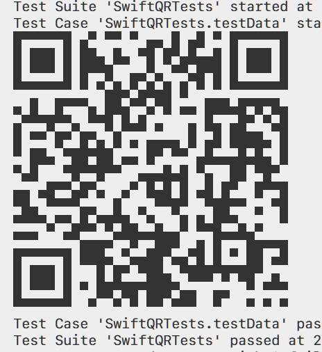

# SwiftQR - Generate QRCode Bitmap

This package is a Swift wrapper of [QR-Code-generator](https://github.com/nayuki/QR-Code-generator.git) C Library.

It works on Linux.

## Getting Started

### Generate QRCode

- Generate from text

```swift
let qrcode = try QRCode(from: "https://www.google.com/ncr")
```

- Generate from binary data

```swift
let data = "https://www.google.com/ncr".data(using: .utf8)!
let qrcode = try QRCode(from: data)
```

- Generate from segments

```swift
let segments = try QRCode(from: [
            .bytes(data),
            .numeric("123"),
            .alphanumeric("123abc")
        ])
let qrcode = try QRCode(from: segments)
```

### Get bitmap

```swift
let bitmap: [[Bool]] = qrcode.qrcodeData
```

### ASCII Image

```swift
let asciiImage: String = qrcode.asciiImage
print(asciiImage)
```

